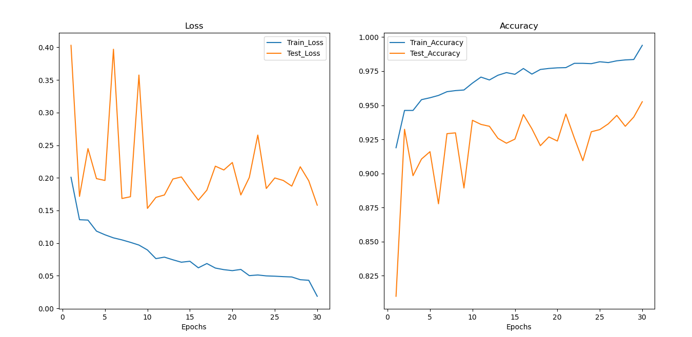
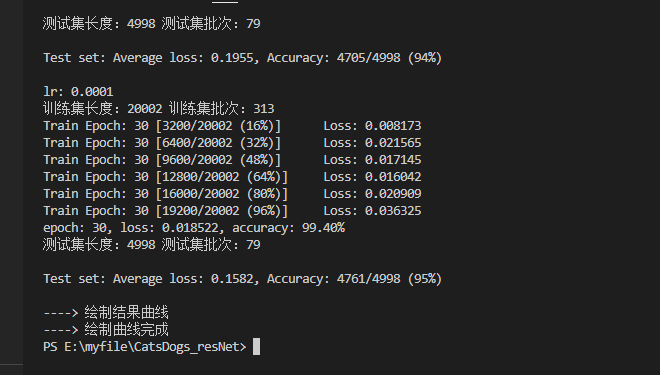

# ResNet 34
## 1.数据预处理
### 数据清洗
●处理缺失值和异常值：在图像分类任务中，通常需要确保所有图像文件存在且可读取。可以使用脚本或工具检查数据集文件的完整性，并剔除损坏或不可读的图像文件。
### 数据增强
●增强技术：采用旋转、平移、缩放、翻转等数据增强技术增加训练样本的多样性，从而提高模型的泛化能力。
●实现：使用torchvision.transforms模块进行数据增强。
### 数据预处理
``` 
transform = transforms.Compose([
    transforms.Resize((128, 128)),
    transforms.ToTensor(),
    transforms.Normalize([0.5, 0.5, 0.5], [0.5, 0.5, 0.5])
 
])
transform_test = transforms.Compose([
    transforms.Resize((128, 128)),
    transforms.ToTensor(),
    transforms.Normalize([0.5, 0.5, 0.5], [0.5, 0.5, 0.5])
])
``` 


## 2. 模型构建
### 模型架构
●采用Pytorch自带的预训练的ResNet-34模型，并修改其最后一层全连接层以适应二分类任务（猫和狗）。
●详细结构包括多个卷积层、池化层和全连接层。
```
# 实例化模型并且移动到GPU
criterion = nn.CrossEntropyLoss()
model = torchvision.models.resnet34(pretrained=True) #加载预训练模型
num_ftrs = model.fc.in_features
model.fc = nn.Linear(num_ftrs, 2)
model.to(DEVICE)
```

## 3. 超参数选择 
●学习率：1e-3，适中学习率可确保模型收敛且避免陷入局部最优解。
●批次大小：64，选择适中的批次大小可平衡计算资源和模型训练速度。
●训练轮数：30，足够的训练轮数可确保模型有足够时间学习数据特征。
``` 
BATCH_SIZE = 64                         # 一次训练的图片数量
EPOCHS = 30                             # 训练轮数
modellr = 1e-3                          # 学习率
```

## 4. 训练过程
### 损失函数
●使用交叉熵损失函数，该函数适用于分类任务，可有效度量模型预测的概率分布与真实标签之间的差异。
```
criterion = nn.CrossEntropyLoss()
```
### 优化算法
●选择Adam优化器，其具有自适应学习率，能够在不同梯度下进行动态调整，有助于加速收敛和避免局部最优解。
```
optimizer = optim.Adam(model.parameters(), weight_decay=5e-4, lr=modellr)
```
### 训练策略
●学习率调整：每30轮训练后将学习率衰减10%，防止模型过早收敛。
●早停策略：当验证集准确率不再提升时停止训练。
```
def adjust_learning_rate(optimizer, epoch):
    modellrnew = modellr * (0.1 ** (epoch // 30))
    print("lr:", modellrnew)
    for param_group in optimizer.param_groups:
        param_group['lr'] = modellrnew
```


## 5. 模型验证
### 验证指标
●选择准确率作为验证指标，直观且适用于分类任务。
### 验证方法
●使用测试集进行验证（训练集测试集为8:2），确保模型的泛化能力。
### 结果打印
●使用绘图函数将每轮得到的正确率和损失率绘制成折线图，方便观察变化趋势。
从绘制的折线图可以看出，训练集的准确率在稳定上升，损失在稳定下降，且并未完全收敛，继续训练可能得到更佳的模型；测试集的准确率和损失虽然有部分抖动，但总体趋势为准确率上升。

在经过30轮的训练，准确率达到了95.2581%，继续训练准确率可能继续增加



